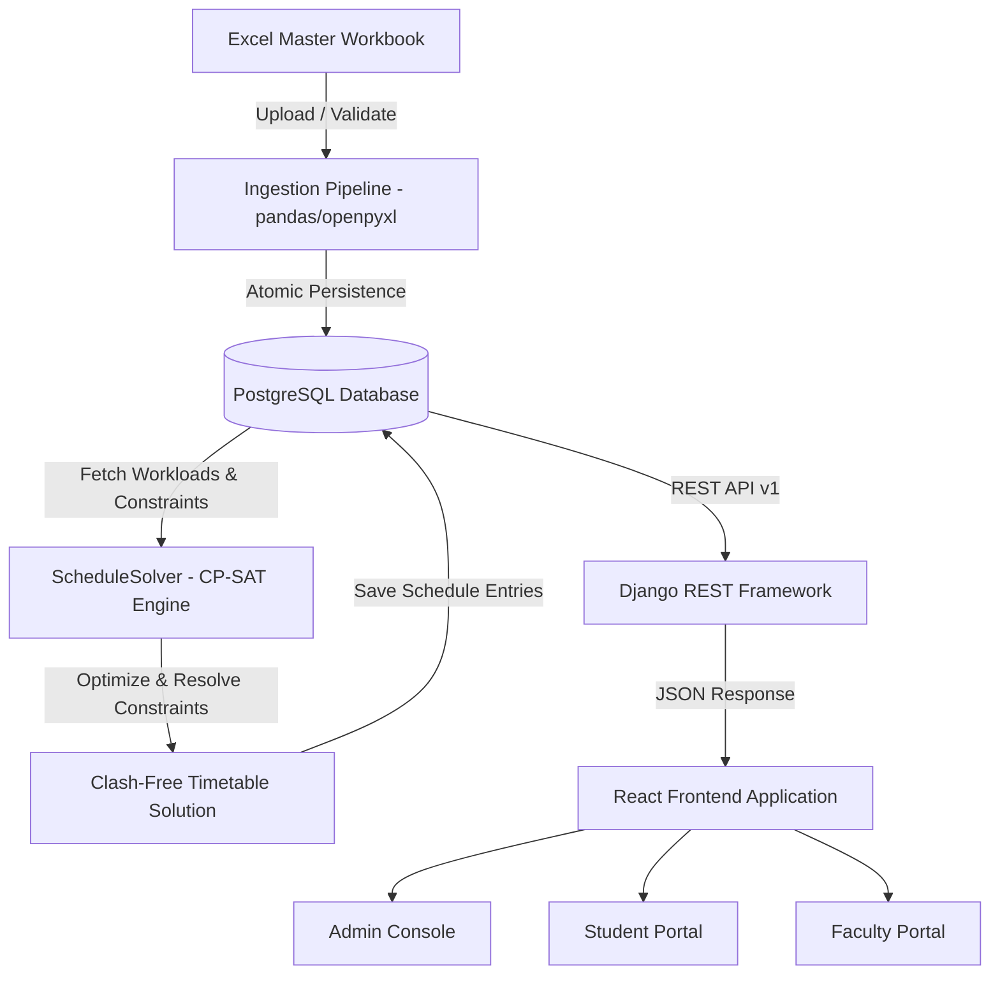

# Automatic Class Routine Generator (CP-SAT)

An enterprise-grade, institutional timetable optimization and scheduling system built with **Google OR-Tools CP-SAT**, **Django REST Framework**, **PostgreSQL**, and **React**.

---

## 📌 Overview

The **Automatic Class Routine Generator** solves complex multi-variable academic timetable scheduling problems for universities and colleges. It replaces manual, error-prone scheduling with mathematical constraint programming, guaranteeing zero timetable conflicts across student cohorts, faculty members, and specialized physical spaces.

### 🌟 Key Highlights

- **CP-SAT Constraint Programming Engine**: Powered by Google OR-Tools to solve high-dimensional timetable constraints in under 20 seconds.
- **NEP 2020 Multi-Disciplinary Support**: Synchronizes open electives across branches into simultaneous periods without cross-departmental clashes.
- **Consecutive Lab Session Allocation**: Automatically reserves 3 consecutive period blocks in designated laboratory facilities without breaking across recess intervals.
- **Dynamic Excel Ingestion**: Parses master spreadsheets (`Cohorts`, `Faculty`, `Rooms`, `Subjects`, `Curriculum_Workload`) with comprehensive syntactic and semantic validation.
- **Live 3-Layer Clash Detection**: Real-time validation preventing room capacity over-allocation, faculty double-booking, and cohort overlapping during manual schedule adjustments.
- **Institutional Design System**: Clean, minimal UI with full **Light** and **Dark** mode support, keyboard accessibility, print-ready stylesheets, and dedicated portals for **Administrators**, **Students**, and **Faculty**.

---

## 🏛️ System Architecture



---

## 🚀 Portals & Interfaces

| Portal | Audience | Features |
| :--- | :--- | :--- |
| **Administrator Console** | Registrars & Heads of Department | Master CP-SAT solver execution, Excel workbook ingestion, interactive timetable grid, and drag/click manual slot overrides with clash simulation. |
| **Student Portal** | Undergraduate & Postgraduate Students | Section-wise clash-free schedules, NEP elective course badging, and one-click printable timetable formats. |
| **Faculty Portal** | Professors & Instructors | Weekly workload counter, pre-assigned lecture halls and laboratory locations, with guaranteed zero double-bookings. |
| **Portals Hub** | All Institutional Roles | Centralized navigation gateway for accessing dedicated sub-portals. |

---

## 🛠️ Tech Stack

### Backend & Solver
- **Language**: Python 3.10+
- **Solver Engine**: [Google OR-Tools CP-SAT](https://developers.google.com/optimization/cp/cp_solver) (Constraint Programming - Satisfiability)
- **Web Framework**: Django 6.x / Django REST Framework
- **Database**: PostgreSQL 14+
- **Data Ingestion**: pandas, openpyxl, psycopg2

### Frontend & UI
- **Framework**: React 18
- **Styling**: Tailwind CSS (with custom institutional tokens)
- **Icons**: Lucide React
- **Typography**: Inter (UI text) & JetBrains Mono (Codes, rooms, timestamps)
- **Networking**: Axios

---

## 📋 Timetable Constraints Modeled

### Hard Constraints (Strictly Enforced)
1. **No Faculty Overlap**: A faculty member can teach at most one class per period slot.
2. **No Room Overlap**: A room/hall/lab can host at most one class per period slot.
3. **No Cohort Overlap**: A cohort section can attend at most one core lecture/lab per period slot.
4. **Room Capacity Feasibility**: Room capacity must be greater than or equal to the cohort size.
5. **Smart Classroom / Facility Compliance**: Courses with `MUST_HAVE` smart room requirements are exclusively assigned to equipped rooms.
6. **Consecutive Practical Sessions**: Lab practicals requiring multiple periods are strictly scheduled as contiguous blocks within the same day and facility.
7. **Recess Preservation**: Lunch break period (Slot 5) remains completely free of academic classes.

### Soft Constraints (Optimized)
1. **Faculty Availability Preferences**: Priority given to faculty preferred teaching windows.
2. **Cognitive Load Distribution**: Heavy theoretical subjects are evenly distributed across the 5 weekdays.
3. **Daily Lecture Balance**: Avoids scheduling more than 4 heavy lectures on any single day for a cohort.

---

## 📦 Getting Started

### Prerequisites
- Python 3.10 or higher
- Node.js 18 or higher & npm
- PostgreSQL 14+ running locally or remotely

---

### 1. Backend Setup

1. **Clone the repository**:
   ```bash
   git clone https://github.com/Soumadipta-Konar/Routine-Generator-CP-SAT.git
   cd Routine-Generator-CP-SAT
   ```

2. **Create and activate a virtual environment**:
   ```bash
   python -m venv .venv
   # Windows (PowerShell):
   .venv\Scripts\Activate.ps1
   # macOS / Linux:
   source .venv/bin/activate
   ```

3. **Install Python dependencies**:
   ```bash
   pip install -r requirements.txt
   ```

4. **Configure Environment Variables**:
   Create a `.env` file in the root directory (or update existing):
   ```env
   DB_HOST=localhost
   DB_PORT=5432
   DB_NAME=routine_generator
   DB_USER=postgres
   DB_PASSWORD=your_postgres_password
   DJANGO_SECRET_KEY=your_secret_key
   DEBUG=True
   ```

5. **Initialize Database Schema**:
   ```bash
   python backend/manage.py migrate
   ```

6. **Start the Django Backend Server**:
   ```bash
   python backend/manage.py runserver 8000
   ```
   The backend API will be available at `http://localhost:8000/api/v1/`.

---

### 2. Frontend Setup

1. **Navigate to the frontend directory**:
   ```bash
   cd frontend
   ```

2. **Install Node dependencies**:
   ```bash
   npm install
   ```

3. **Start the React Development Server**:
   ```bash
   npm start
   ```
   The application will be accessible at `http://localhost:3000`.

---

## 🧪 Ingestion & Solver Quickstart via CLI

You can also run the ingestion and solver directly from the command line:

```bash
# 1. Ingest sample Excel workbook into PostgreSQL:
python backend/apps/imports/parser.py master_schedule_sample.xlsx

# 2. Run the CP-SAT engine directly:
python solver/engine.py
```

---

## 📡 REST API Reference

| Method | Endpoint | Description |
| :--- | :--- | :--- |
| `POST` | `/api/v1/schedules/solver/generate/` | Triggers CP-SAT solver and persists timetable entries. |
| `GET` | `/api/v1/schedules/meta/` | Fetches active cohorts, faculty members, and rooms. |
| `GET` | `/api/v1/schedules/cohort/<id>/` | Returns the weekly 5x9 matrix for a specific cohort. |
| `GET` | `/api/v1/schedules/faculty/<id>/` | Returns the weekly 5x9 matrix for a specific faculty member. |
| `GET` | `/api/v1/schedules/room/<id>/` | Returns the weekly utilization matrix for a specific room. |
| `POST` | `/api/v1/schedules/override/` | Moves a class slot with real-time 3-layer clash detection. |
| `POST` | `/api/v1/imports/master-workbook/` | Ingests and parses `.xlsx` master schedule files. |
| `GET` | `/api/v1/imports/download-sample/` | Downloads a blank master Excel template workbook. |

---

## 📄 License

This project is licensed under the **MIT License**.
