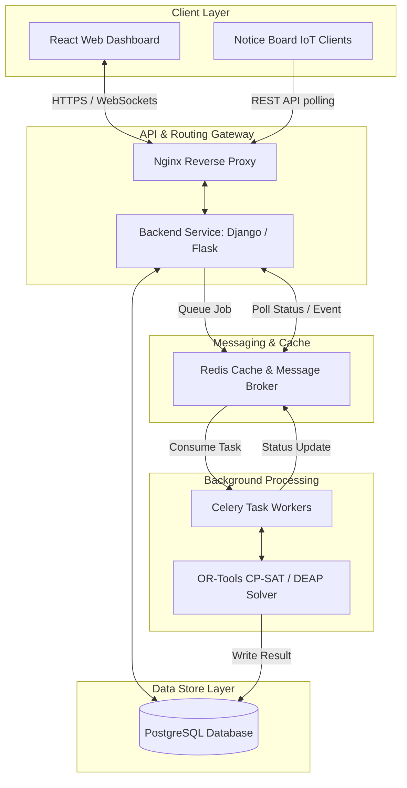
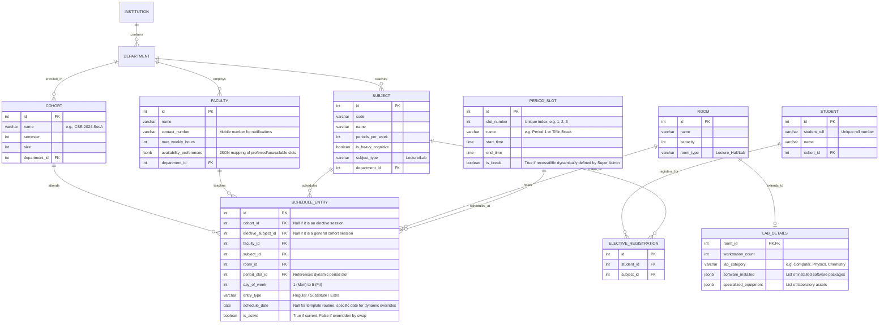
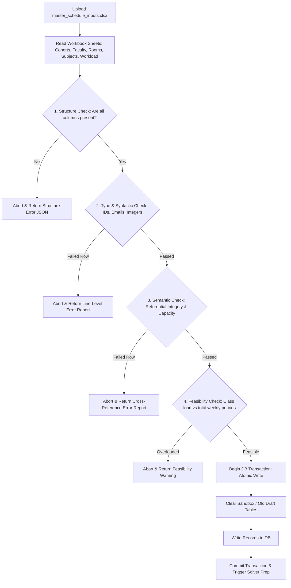
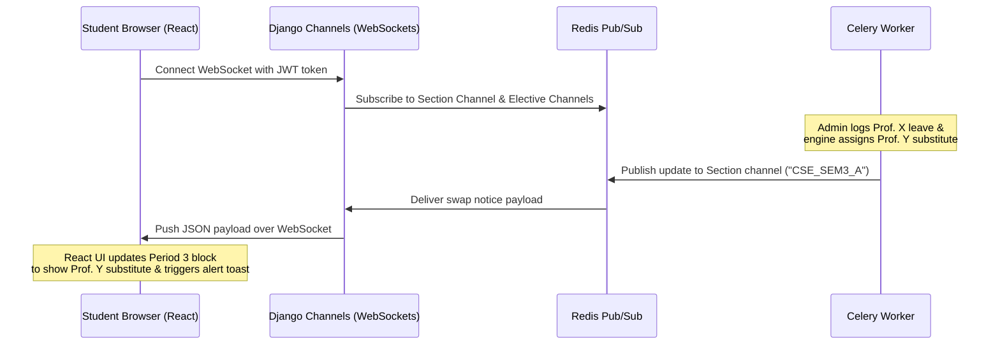

# System Architecture Document
## Automatic Optimized Class Routine Generation System

This document describes the technical architecture, component design, optimization model, and data schema for the Automatic Optimized Class Routine Generation System.

---

## 1. High-Level Architectural Overview

The system is designed as a modern distributed web application with a separated frontend (React) and backend (Python Flask/Django), utilizing an asynchronous task queue (Celery & Redis) to offload the heavy computational workload of the optimization engine (Google OR-Tools CP-SAT).



### Component Descriptions:
1.  **React Web Dashboard:** Client-side application for admins (data input, manual override grid) and faculty/students (personalized schedules).
2.  **Nginx:** Reverse proxy handling SSL termination, static file serving, and rate limiting.
3.  **Django/Flask API:** Core backend application logic, REST endpoints, user authentication, and manual override transaction management.
4.  **Redis:** Serves dual roles as a Celery message broker and a fast in-memory cache for generated schedules and current notices.
5.  **Celery Workers:** Background worker processes executing the timetabling optimization engine, preventing HTTP timeouts.
6.  **Google OR-Tools Solver:** High-performance Constraint Programming (CP-SAT) solver that evaluates variables and outputs schedule matrix.
7.  **PostgreSQL:** Relational database containing normalized schemas for institutional data.

---

## 2. Database Schema Design (Entity Relationship)

The schema represents the relational entities and their constraints. Below is the structured outline of the PostgreSQL tables.



### Table Definitions (DDL Highlights)

#### `FACULTY` Table
```sql
CREATE TABLE faculty (
    id SERIAL PRIMARY KEY,
    name VARCHAR(100) NOT NULL,
    contact_number VARCHAR(15) UNIQUE NOT NULL, -- Replaced email for direct mobile notifications and super admin calls
    max_weekly_hours INT DEFAULT 18,
    availability_preferences JSONB, -- Example: {"unavailable": [[1, 1], [1, 2]], "preferred": [[2, 3]]}
    department_id INT REFERENCES department(id) ON DELETE CASCADE
);
```

#### `SUBJECT` Table
```sql
CREATE TABLE subject (
    id SERIAL PRIMARY KEY,
    code VARCHAR(15) UNIQUE NOT NULL,
    name VARCHAR(100) NOT NULL,
    periods_per_week INT NOT NULL DEFAULT 4,
    is_heavy_cognitive BOOLEAN DEFAULT FALSE,
    subject_type VARCHAR(10) CHECK (subject_type IN ('Lecture', 'Lab')),
    department_id INT REFERENCES department(id) ON DELETE CASCADE
);
```

#### `ROOM` Table
```sql
CREATE TABLE room (
    id SERIAL PRIMARY KEY,
    name VARCHAR(50) NOT NULL,
    capacity INT NOT NULL,
    room_type VARCHAR(15) CHECK (room_type IN ('Lecture_Hall', 'Lab')) NOT NULL
);
```

#### `LAB_DETAILS` Table
```sql
CREATE TABLE lab_details (
    room_id INT PRIMARY KEY REFERENCES room(id) ON DELETE CASCADE,
    workstation_count INT NOT NULL DEFAULT 0,
    lab_category VARCHAR(30) NOT NULL, -- e.g., 'Computer', 'Chemistry', 'Physics'
    software_installed JSONB DEFAULT '[]'::jsonb, -- e.g., ["MATLAB", "R-Studio", "AutoCAD"]
    specialized_equipment JSONB DEFAULT '[]'::jsonb -- e.g., ["Oscilloscope", "Centrifuge"]
);
```

#### `PERIOD_SLOT` Table
```sql
CREATE TABLE period_slot (
    id SERIAL PRIMARY KEY,
    slot_number INT UNIQUE NOT NULL, -- e.g., 1, 2, 3...
    name VARCHAR(30) NOT NULL, -- e.g., 'Period 1', 'Lunch Break'
    start_time TIME NOT NULL,
    end_time TIME NOT NULL,
    is_break BOOLEAN NOT NULL DEFAULT FALSE -- Set TRUE dynamically by Super Admin to mark recess/tiffin
);
```

#### `SCHEDULE_ENTRY` Table
```sql
CREATE TABLE schedule_entry (
    id SERIAL PRIMARY KEY,
    cohort_id INT REFERENCES cohort(id) ON DELETE CASCADE, -- NULL if elective/optional class
    elective_subject_id INT REFERENCES subject(id) ON DELETE CASCADE, -- NULL if cohort-wide core class
    faculty_id INT REFERENCES faculty(id) ON DELETE SET NULL,
    subject_id INT REFERENCES subject(id) ON DELETE CASCADE,
    room_id INT REFERENCES room(id) ON DELETE SET NULL,
    period_slot_id INT REFERENCES period_slot(id) ON DELETE CASCADE, -- Dynamically mapped period slot
    day_of_week INT CHECK (day_of_week BETWEEN 1 AND 5), -- Restricted to standard Monday-Friday academic week
    entry_type VARCHAR(15) DEFAULT 'Regular', -- 'Regular', 'Substitute', 'Extra', 'Exam'
    schedule_date DATE, -- NULL for general weekly routine; non-null for specific overrides
    smart_class_requirement VARCHAR(15) CHECK (smart_class_requirement IN ('MUST_HAVE', 'PREFERRED', 'NOT_REQUIRED')) DEFAULT 'NOT_REQUIRED', -- Defined per faculty-subject mapping
    is_active BOOLEAN DEFAULT TRUE,
    created_at TIMESTAMP DEFAULT CURRENT_TIMESTAMP
);
CREATE INDEX idx_schedule_lookup ON schedule_entry (day_of_week, period_slot_id, is_active);
CREATE INDEX idx_schedule_date ON schedule_entry (schedule_date) WHERE schedule_date IS NOT NULL;
```

---

## 3. Optimization Engine Architecture & Math Modeling

The core solver uses **Google OR-Tools CP-SAT**. Instead of standard heuristic Genetic Algorithms, which do not guarantee hard constraint satisfaction, CP-SAT models the problem as a **Constraint Satisfaction Problem (CSP)** with soft constraints represented as optimization costs.

### 3.1 Model Variables
Let:
*   $L$ be the set of lectures/sessions to schedule. Each lecture $l \in L$ represents a single period requirement (e.g., if Math needs 4 periods, it has 4 entries in $L$).
*   $SL$ be the set of time slots, indexed by day $d$ and dynamically configured period slots $ps$: $SL = \{(d, ps) \mid d \in \text{Days}, ps \in \text{PeriodSlots} \land \text{is\_break}(ps) = \text{False}\}$. This dynamically excludes tiffin/recess slots from academic class scheduling.
*   $R$ be the set of classrooms/labs.

For each lecture $l$, slot $sl$, and room $r$, we define a boolean decision variable:
$$x_{l, sl, r} \in \{0, 1\}$$
where $x_{l, sl, r} = 1$ if lecture $l$ is scheduled at slot $sl$ in room $r$, and $0$ otherwise.


---

### 3.2 Hard Constraints (Must Satisfy)

#### A. Schedule Exactly Once
Every lecture session $l$ must be scheduled in exactly one slot and one room:
$$\sum_{sl \in SL} \sum_{r \in R} x_{l, sl, r} = 1 \quad \forall l \in L$$

#### B. Faculty Clash Prevention
A faculty member $f$ cannot teach in more than one room at any given time slot $sl$:
$$\sum_{l \in L \text{ taught by } f} \sum_{r \in R} x_{l, sl, r} \le 1 \quad \forall f \in \text{Faculty}, \forall sl \in SL$$

#### C. Room Double-Booking Prevention
A classroom $r$ cannot host more than one lecture at any slot $sl$:
$$\sum_{l \in L} x_{l, sl, r} \le 1 \quad \forall r \in R, \forall slot \in SL$$

#### D. Room Capacity Matching
For any lecture $l$ scheduled in room $r$, the cohort size must not exceed the capacity of $r$:
$$x_{l, sl, r} = 0 \quad \text{if } \text{Capacity}(r) < \text{Size}(c(l))$$

#### E. Room Type Suitability
A lab session must be scheduled in a room marked as `Lab`, and a standard lecture must be scheduled in a `Lecture_Hall`:
$$x_{l, sl, r} = 0 \quad \text{if } \text{RoomType}(r) \neq \text{SubjectType}(l)$$

#### F. NEP-Compliant Course Clashes (Student-Level Conflict)
Under the National Education Policy (NEP), students have individualized timetables with optionals/electives.
Let $S_{tudents}$ be the set of registered students. Let $S(s)$ be the set of subjects registered by student $s$.
If two subjects $sub_1, sub_2$ are registered by the same student $s$ ($sub_1 \in S(s) \land sub_2 \in S(s)$), their lecture sessions $l_1$ ($subject(l_1) = sub_1$) and $l_2$ ($subject(l_2) = sub_2$) **cannot** overlap in the same slot $sl$:
$$\sum_{r \in R} (x_{l_1, sl, r} + x_{l_2, sl, r}) \le 1 \quad \forall sl \in SL, \forall s \in S_{tudents}$$

#### G. Practical Lab Contiguity (Multi-Period Lab Blocks)
*   **Goal:** A lab session of duration $D > 1$ periods must run consecutively in the same room on the same day without being split by the recess break.
*   **Formulation in CP-SAT:**
    Instead of scheduling separate single-period variables, the solver models each lab session $l_{lab}$ as a contiguous interval variable:
    $$\text{IntervalVar}(l_{lab}) = \text{NewIntervalVar}(\text{Start}_{l_{lab}}, \text{Duration}_{l_{lab}}, \text{End}_{l_{lab}})$$
    Where:
    *   $\text{Start}_{l_{lab}}$ is an integer variable representing the starting time slot index.
    *   $\text{Duration}_{l_{lab}} = D$ (e.g., 2 or 3 periods).
    *   $\text{End}_{l_{lab}} = \text{Start}_{l_{lab}} + D$.
    
    To prevent splitting across fixed breaks (e.g., recess at period 4), we define the set of break periods $B_{slots} \subset SL$. For all slots $b \in B_{slots}$ and lab sessions $l_{lab}$:
    $$\text{Start}_{l_{lab}} + k \neq b \quad \forall k \in [0, D-1]$$
    This enforces that no part of the lab interval overlaps with school break slots.

#### H. Exam Seating Anti-Contiguity (Same Subject Protection)
During exam periods, to prevent cheating, no two students writing the same subject exam $Sub_{exam}$ can sit next to each other.
Let $G$ be the grid of seats in a classroom, where $G(i, j)$ represents seat at row $i$, column $j$.
Let $y_{s, i, j}$ be a boolean variable indicating if student $s$ is assigned to seat $G(i, j)$.
If student $s_1$ and $s_2$ are assigned to adjacent seats ($G(i, j)$ and $G(i, j+1)$ or $G(i+1, j)$), their exam subjects must be different:
$$\text{ExamSubject}(s_1) \neq \text{ExamSubject}(s_2)$$
In practice, the solver partitions the classroom grid into an alternating checkerboard pattern of subjects, or inserts empty buffer seats ($y_{\text{empty}, i, j} = 1$) if subjects cannot be alternated.

---

### 3.3 Soft Constraints & Optimization Objective (Minimizing Penalties)

Soft constraints are added to the optimization objective as weighted penalties.

#### A. Spacing Out Heavy Subjects
*   **Goal:** A student cohort should not have heavy cognitive workload classes (e.g., Math, Physics) in consecutive periods.
*   **Formulation:**
    Let $H_c(l) = 1$ if lecture $l$ is a heavy subject for cohort $c$, and $0$ otherwise.
    Let $Y_{c, d, p}$ be a boolean variable indicating if cohort $c$ has a heavy class scheduled at day $d$, period $p$:
    $$Y_{c, d, p} = \sum_{l \in L : c(l) = c \land s(l) \in \text{Heavy}} \sum_{r \in R} x_{l, (d, p), r}$$
    We introduce a penalty variable $\text{HeavyClash}_{c, d, p} \in \{0, 1\}$ satisfying:
    $$\text{HeavyClash}_{c, d, p} \ge Y_{c, d, p} + Y_{c, d, p+1} - 1$$
    $$\text{Minimize } \sum_{c, d, p} \text{HeavyClash}_{c, d, p} \times \text{Weight}_{\text{heavy\_spacing}}$$

#### B. Faculty Consecutive Hours Limit
*   **Goal:** Avoid scheduling a faculty member for 3 or more consecutive periods.
*   **Formulation:**
    Let $Z_{f, d, p}$ be a boolean variable indicating if faculty $f$ is teaching at day $d$, period $p$:
    $$Z_{f, d, p} = \sum_{l \in L \text{ taught by } f} \sum_{r \in R} x_{l, (d, p), r}$$
    We penalize three consecutive sessions:
    $$\text{Consecutive3Hours}_{f, d, p} \ge Z_{f, d, p} + Z_{f, d, p+1} + Z_{f, d, p+2} - 2$$
    $$\text{Minimize } \sum_{f, d, p} \text{Consecutive3Hours}_{f, d, p} \times \text{Weight}_{\text{consecutive\_teacher}}$$

#### C. Preferred Faculty Slots
*   **Goal:** Respect faculty preferences for specific slots (morning shifts, no late-afternoon slots).
*   **Formulation:**
    Let $P_{f, sl}$ be the penalty weight for faculty $f$ if assigned to slot $sl$ (defined in faculty profile).
    $$\text{Minimize } \sum_{l \in L} \sum_{sl \in SL} \sum_{r \in R} x_{l, sl, r} \times P_{\text{Faculty}(l), sl}$$

#### D. Smart Classroom Preferences (Infeasibility Mitigation & Warning)
*   **Goal:** Accommodate three categories of smart classroom requirements (`MUST_HAVE`, `PREFERRED`, `NOT_REQUIRED`) based on professor-subject preferences while preventing solver failure during resource scarcity.
*   **Formulation:**
    Let $S_{smart} \subset R$ be the set of rooms containing smart display or projector capabilities.
    
    1.  **Must Have (`MUST_HAVE`):** 
        We define a binary penalty variable $V_{l}^{must} \in \{0, 1\}$ for each lecture $l$ requiring a smart room:
        $$V_{l}^{must} \ge \sum_{sl \in SL} \sum_{r \notin S_{smart}} x_{l, sl, r}$$
        We add to the objective function:
        $$\text{Minimize } \sum_{l \in L_{must}} V_{l}^{must} \times W_{must} \quad (\text{where } W_{must} = 100,000)$$
        
    2.  **Preferred / Good If (`PREFERRED`):**
        We define a binary penalty variable $V_{l}^{pref} \in \{0, 1\}$ for each lecture $l$ preferring a smart room:
        $$V_{l}^{pref} \ge \sum_{sl \in SL} \sum_{r \notin S_{smart}} x_{l, sl, r}$$
        We add to the objective function:
        $$\text{Minimize } \sum_{l \in L_{pref}} V_{l}^{pref} \times W_{pref} \quad (\text{where } W_{pref} = 50)$$

    3.  **Neutral / Don't Need (`NOT_REQUIRED`):**
        To prevent standard lectures from hogging smart rooms, we penalize scheduling a `NOT_REQUIRED` class in a smart room:
        $$V_{l}^{waste} \ge \sum_{sl \in SL} \sum_{r \in S_{smart}} x_{l, sl, r}$$
        We add to the objective function:
        $$\text{Minimize } \sum_{l \in L_{not}} V_{l}^{waste} \times W_{waste} \quad (\text{where } W_{waste} = 10)$$

#### E. Low Resources Warning System Architecture
When the Celery worker receives the completed assignment matrix from OR-Tools:
1.  It checks the total objective value.
2.  It queries if any $V_{l}^{must} = 1$.
3.  If any $V_{l}^{must} == 1$, the worker marks the generation run status in Redis/PostgreSQL as `COMPLETED_WITH_WARNINGS` and logs the clashing lectures to a `low_resource_log` JSON field in the schedule table.
4.  The Django API pushes this list to the Admin Dashboard via WebSockets. The admin sees an alert:
    ⚠️ **Low Resource Alert:** 3 classes requiring smart classrooms were placed in standard rooms due to room shortage.

---

## 4. Dynamic Rescheduling & Substitution Logic

When an override command is sent (e.g., "Professor X is on leave on 2026-08-26"):

1.  **Retrieve Impacted Schedules:** Find all active `schedule_entry` records matching the date and faculty ID.
2.  **Initiate Localized Rescheduler:**
    Instead of regenerating the entire timetable (which alters other unchanged slots and causes administrative chaos), the system initiates **Localized In-Place Rescheduling**:
    *   **Phase 1: Direct Substitution Search**
        *   Find alternative faculty within the same department.
        *   Validate they are free during the impacted slots (using the DB indices on `schedule_entry`).
        *   Filter out anyone who would exceed their max daily/weekly teaching limit.
    *   **Phase 2: Swap Suggestion**
        *   If no substitute is free, scan the affected student cohort's schedule for other days.
        *   Identify a candidate slot $(d', p')$ to swap classes.
        *   Validate that both teachers (the absent teacher and the candidate swap teacher) are mutually free at each other's swapped slots.
3.  **Conflict Resolution UI:** Show these options to the Admin with an explainability card:
    > "Substitution Option: Prof. Y can cover Period 3. (Reason: Free, teaches CSE, 14 hours taught this week, Contact: +91 98765 43210)."

---

## 5. Real-Time Sync & IoT Notice Board Integration

To ensure the latest routine changes are broadcasted:
1.  **WebSockets (Socket.IO / Django Channels):** Establish connection between browser dashboard and backend. When a substitution is saved, an instant push event is broadcasted to:
    *   Logged-in Students of the affected Section.
    *   The substitute Faculty member.
2.  **Notice Board REST API:** Classroom-mounted tablets or digital LED displays pull their schedule using a simple JSON API:
    ```http
    GET /api/v1/rooms/room_302/today
    ```
    Response payload:
    ```json
    {
      "room": "Room 302",
      "date": "2026-08-25",
      "schedule": [
        { "period": 1, "time": "09:00 - 09:50", "cohort": "CSE-A", "subject": "Data Structures", "faculty": "Prof. Sen", "status": "Regular" },
        { "period": 2, "time": "09:50 - 10:40", "cohort": "CSE-B", "subject": "Discrete Math", "faculty": "Prof. Das (Substitute)", "status": "Substitute" },
        { "period": 3, "time": "10:40 - 11:30", "cohort": null, "subject": "Recess", "faculty": null, "status": "Break" }
      ]
    }
    ```

---

## 6. Data Ingestion & Parser Pipeline

To process bulk data uploads efficiently and reliably, the backend exposes a dedicated API:
```http
POST /api/v1/imports/master-workbook
```
Accepts a multipart file upload containing the `master_schedule_inputs.xlsx` workbook.

### 6.1 Parser Technology Stack
*   **Engine:** Python with `pandas` and `openpyxl` libraries.
*   **Transactional Engine:** Django's `transaction.atomic()` context manager. This ensures that database writes for all sheets are executed within a single transaction block. If any validation fails, the transaction is rolled back, preventing partial data corruption.

### 6.2 Execution Flow & Validation Chain


### 6.3 Validation Error Response JSON Schema
If an import fails, the API returns a `400 Bad Request` with a descriptive JSON payload identifying exactly where the data failed validation. This ensures admins can correct sheets without deciphering raw SQL traceback logs:

```json
{
  "status": "error",
  "message": "Workbook ingestion failed due to semantic and referential validation errors.",
  "errors": [
    {
      "sheet": "Curriculum_Workload",
      "row": 42,
      "column": "Faculty_ID",
      "value": "FAC_DR_SEN",
      "error_type": "Referential_Integrity_Failure",
      "description": "Faculty_ID 'FAC_DR_SEN' is referenced in the workload sheet but does not exist in the 'Faculty' sheet registry."
    },
    {
      "sheet": "Cohorts",
      "row": 15,
      "column": "Size",
      "value": "85",
      "error_type": "Capacity_Feasibility_Failure",
      "description": "Cohort size (85) exceeds the maximum capacity of any available 'Lecture' room in the 'Rooms' sheet (Max room capacity is 60)."
    }
  ]
}
```

---

## 7. Student Schedule Dashboard Architecture

To allow students to view their classes, electives, and real-time routine updates, the system implements a dedicated Student Schedule Dashboard.

### 7.1 Visual Layout & Interactive Capabilities
*   **Weekly Grid Interface:** A responsive calendar grid (using CSS Grid and Tailwind CSS) showing the 8-period structure for Monday-Friday. 
*   **Elective Mapping Integration:** The dashboard pulls the student's unique enrollment profile. Unlike standard section viewports, it blends their parent cohort's standard classes with their specific NEP elective classes into a unified weekly view.
*   **Status Color Coding:**
    *   *Regular classes:* Standard blue blocks.
    *   *Substitutions:* Green blocks containing the substitute faculty's name and contact.
    *   *Cancellations / Warnings:* Stripped grey blocks with alert badges.
*   **Quick Filters:** Toggle to filter by core/elective status or search for specific subjects.

### 7.2 Communication Flow & Real-Time Sync
The student dashboard connects to the backend through a WebSocket connection to listen for schedule overrides without requiring page reloads:



### 7.3 Data Hydration & Offline Support
*   **API Hydration Endpoint:**
    *   `GET /api/v1/students/me/personalized-schedule`
    *   Fetches a student's active classes, merging general section classes with registered electives.
*   **Offline Mode (PWA):**
    *   A Service Worker intercepts network requests and caches the schedule payload in browser IndexedDB/LocalStorage.
    *   If a student opens the dashboard in a basement lecture hall with zero Wi-Fi, the dashboard falls back to cached data with a badge showing: *"Viewing Offline Schedule (Updated 2 hours ago)"*.
