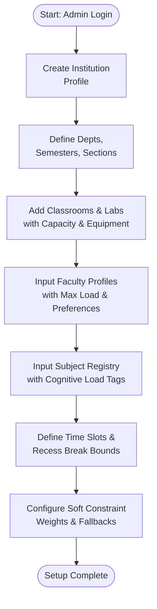
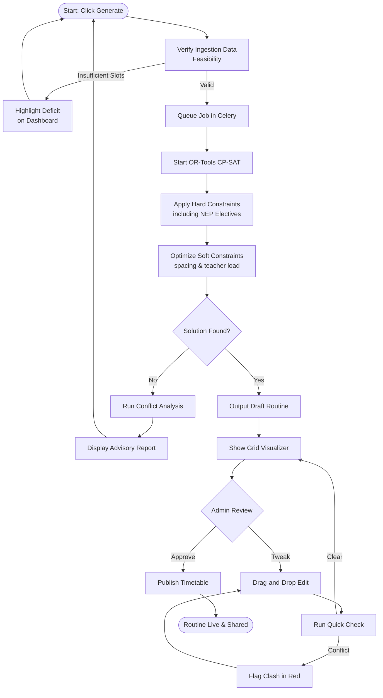
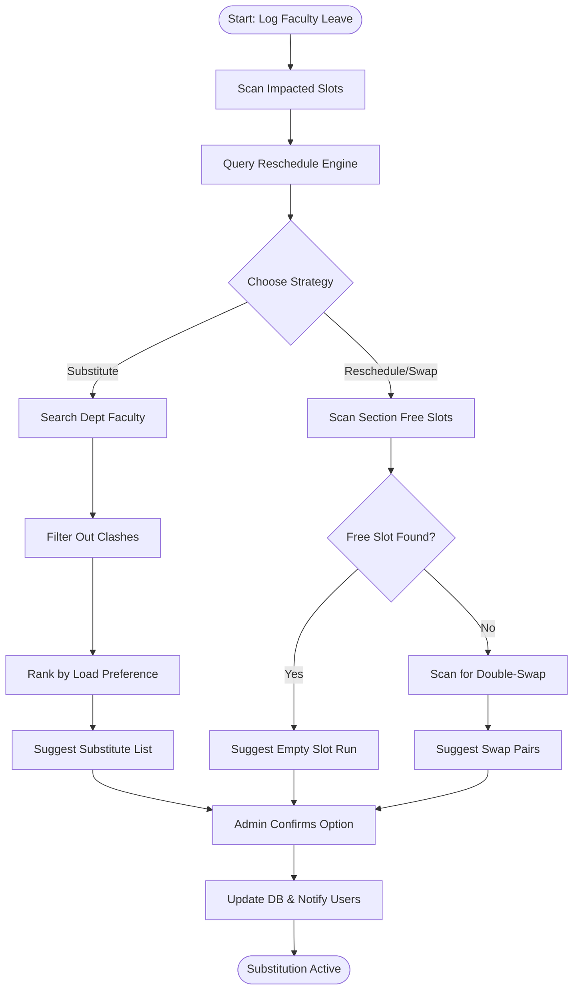
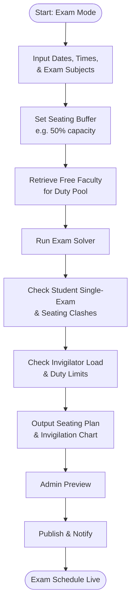
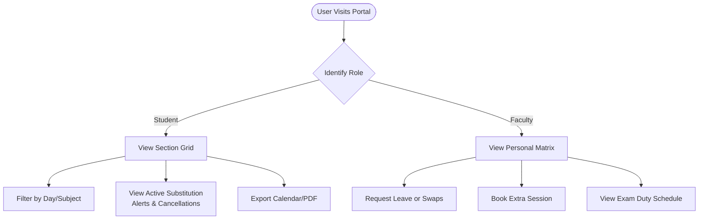

# User Flow Document
## Automatic Optimized Class Routine Generation System

This document outlines the workflows and user journeys for the system. It covers Admin setup, routine generation, dynamic leave rescheduling, and student/faculty visualization.

---

## 1. Admin Onboarding and Setup Flow
Before generating a routine, the Administrator must populate the database with institutional parameters and configure constraints.

---

## 2. Core Routine Generation & Optimization Flow
Once data setup is complete, the admin triggers the routine generator. The system processes constraints and outputs a draft schedule.

---

## 3. Dynamic Rescheduling & Substitute Management Flow
This flow represents the day-to-day operations when a teacher goes on leave or needs an emergency class swap.

---

## 4. Exam Routine & Invigilation Duty Flow
Generating an exam routine differs from class routines as student cohorts take exams simultaneously, and classrooms need sparse seating.

---

## 5. Faculty and Student Schedule Visualization Flow
How consumers access the finalized routine.

